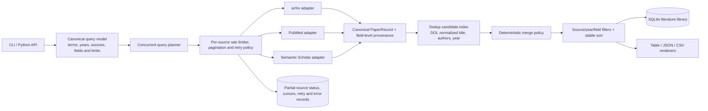
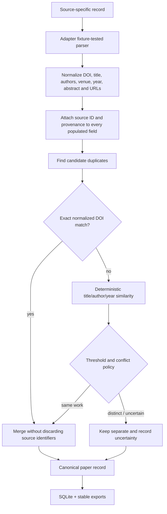
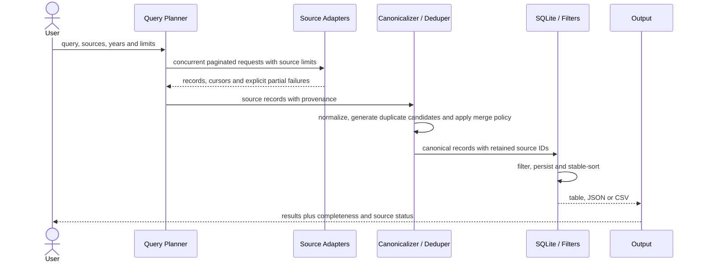

# ResearchQuantize

ResearchQuantize is a production-focused Python CLI and library for aggregating research papers across:
- ArXiv
- PubMed
- Semantic Scholar

It is designed around reliable adapters, resilient parsing, deterministic tests, and straightforward CLI usage.

## Features

- Concurrent aggregation across multiple sources
- Optional source and year filters
- Deduplication with metadata-aware selection
- Export as table, JSON, or CSV
- SQLite persistence layer
- Deterministic unit tests (no network dependency)

## Quick Start

```bash
python3 -m venv .venv
source .venv/bin/activate
pip install -r requirements.txt
```

Run the CLI:

```bash
python src/cli.py version
python src/cli.py aggregate --query "machine learning" --limit 10
python src/cli.py search --query "graph neural networks" --source arxiv --year 2024
python src/cli.py --format json --output results.json aggregate --query "NLP" --limit 20
```

## CLI Commands

```bash
python src/cli.py version
python src/cli.py aggregate --query "..." [--limit 10] [--sources arxiv pubmed semantic_scholar]
python src/cli.py search --query "..." [--source arxiv|pubmed|semantic_scholar] [--year 2024] [--limit 10]
```

Global options:

- `--format table|json|csv`
- `--output <file>`
- `--verbose`

## Project Structure

- `src/aggregator/core.py`: orchestration and concurrency
- `src/aggregator/sources/`: source adapters
- `src/aggregator/models/paper.py`: canonical paper model
- `src/aggregator/search/`: search entrypoints and filters
- `src/aggregator/database/`: SQLite storage
- `src/tests/`: deterministic test suite

## Environment Variables

Optional `.env` values:

```env
DEFAULT_QUERY_LIMIT=10
DEFAULT_SOURCE=arxiv
DEFAULT_YEAR_FILTER=
ARXIV_API_KEY=
PUBMED_API_KEY=
SEMANTIC_SCHOLAR_API_KEY=
DATABASE_PATH=papers.db
LOG_LEVEL=INFO
```

## Testing

```bash
pytest -q
```

## Packaging

```bash
pip install .
researchquantize version
```

## License

MIT. See `LICENSE`.

<!-- architecture-atlas-v5:start -->
## Architecture Atlas v5

These editable Mermaid diagrams mirror the [Notion architecture dossier](https://app.notion.com/p/3b467342e8c181f3a49ac9d072ced5d2?pvs=204).

### 1. Federated-source anatomy



### 2. Deduplication wiring



### 3. Runtime narrative



### 4. Reliability model

```mermaid
stateDiagram-v2
  [*] --> PLANNED
  PLANNED --> FETCHING
  FETCHING --> PARTIAL: one or more sources fail
  FETCHING --> NORMALIZING: all requested pages complete
  PARTIAL --> NORMALIZING: preserve partial-status evidence
  NORMALIZING --> DEDUPING --> FILTERING --> PERSISTED --> EXPORTED
```

<!-- architecture-atlas-v5:end -->
